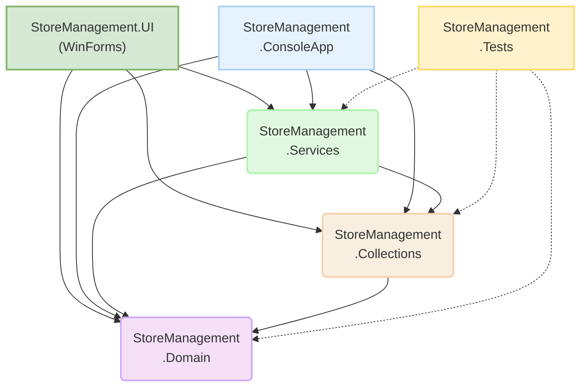

# StoreManagement 🏪

**StoreManagement** — это приложение на C# (.NET 8), демонстрирующее принципы объектно-ориентированного программирования, работу с коллекциями, обработку событий, сериализацию данных и модульное тестирование. Проект включает как **консольный интерфейс** для демонстрации базовой логики, так и **графический интерфейс пользователя (GUI) на Windows Forms** для более наглядного взаимодействия. Приложение имитирует систему управления товарами.

[](https://docs.microsoft.com/dotnet/csharp/)
[](https://dotnet.microsoft.com/download/dotnet/8.0)
[](https://github.com/Vasja1142/StoreManagement/actions)
<!-- Если будете использовать Codecov или аналогичный сервис, добавьте бейдж покрытия -->
<!-- [](https://codecov.io/gh/Vasja1142/StoreManagement) -->

---

## 🌟 Основные возможности

*   **Два интерфейса пользователя:**
    *   `StoreManagement.ConsoleApp`: Консольное приложение для тестирования и демонстрации основной логики.
    *   `StoreManagement.UI`: Графический интерфейс на Windows Forms для интерактивного управления товарами и коллекциями.
*   **Иерархия товаров:** Реализована иерархия классов для различных типов товаров (`Goods` -> `Product` -> `DairyProduct`, `Goods` -> `Toy`).
*   **Пользовательские коллекции:**
    *   `HashTable<TKey, TValue>`: Собственная реализация хеш-таблицы с открытой адресацией (линейное пробирование).
    *   `MyCollection<T>`: Обобщенная коллекция на основе `HashTable`, где ключом является имя товара.
    *   `MyNewCollection<T>`: Расширение `MyCollection<T>` с добавлением событий для отслеживания изменений (добавление, удаление, изменение ссылки на элемент).
*   **Обработка событий:** Механизм событий (`CollectionCountChanged`, `CollectionReferenceChanged`) для реакции на изменения в `MyNewCollection<T>`, используемый в UI для обновления отображения.
*   **Журналирование:** Класс `Journal` для логирования событий изменения коллекций в файл.
*   **Методы расширения LINQ-подобные:** Для `MyNewCollection<T>` реализованы методы `Filter`, `SortBy`, `AggregateAverage`, `GroupByCriteria`.
*   **Сохранение и загрузка данных (Персистентность):**
    *   Поддержка сериализации/десериализации коллекций в форматах:
        *   **Binary** (`BinaryFormatter`)
        *   **JSON** (`System.Text.Json`)
        *   **XML** (`XmlSerializer`)
    *   Обработка полиморфизма при сериализации.
*   **Пользовательский ввод:** Механизмы для инициализации объектов товаров данными, введенными с клавиатуры (в консольном приложении), или через GUI.
*   **Сравнение и сортировка:** Реализация `IComparable<Goods>` (по цене) и кастомный `IComparer<Goods>` (например, `SortByNameComparer`).
*   **Клонирование объектов:** Реализация `ICloneable` для глубокого копирования объектов товаров.
*   **Модульное тестирование:** Обширный набор юнит-тестов с использованием MSTest для проверки корректности работы доменной модели, коллекций и сервисов.

---

## 🏗️ Структура проекта

Проект состоит из нескольких сборочных единиц (проектов), обеспечивающих модульность:

*   **`StoreManagement.Domain`**: Содержит классы доменной модели (`Goods`, `Product`, `DairyProduct`, `Toy`), интерфейсы (`IInit`), компараторы.
*   **`StoreManagement.Collections`**: Включает реализации пользовательских коллекций (`HashTable`, `MyCollection`, `MyNewCollection`) и связанные с ними классы событий.
*   **`StoreManagement.Services`**: Содержит сервисные классы, такие как `Journal` (логирование), `PersistenceService` (сохранение/загрузка), и методы расширения для коллекций (`MyCollectionExtensions`).
*   **`StoreManagement.ConsoleApp`**: Консольное приложение для демонстрации и отладки основной логики.
*   **`StoreManagement.UI`**: Приложение с графическим интерфейсом пользователя на Windows Forms.
*   **`StoreManagement.Tests`**: Проект с юнит-тестами для библиотек `Domain`, `Collections` и `Services`.



---

## 🚀 Начало работы

### Требования

*   [.NET 8 SDK](https://dotnet.microsoft.com/download/dotnet/8.0)
*   IDE (например, Visual Studio 2022, JetBrains Rider), поддерживающая проекты Windows Forms.

### Сборка и запуск

1.  **Клонируйте репозиторий:**
    ```bash
    git clone https://github.com/Vasja1142/StoreManagement.git
    cd StoreManagement
    ```

2.  **Сборка проекта:**
    Откройте решение (`StoreManagement.sln`) в вашей IDE (например, Visual Studio) и соберите его (Build Solution). Либо выполните в корневой папке решения:
    ```bash
    dotnet build
    ```

3.  **Запуск приложений:**
    *   **Windows Forms UI (`StoreManagement.UI`):**
        *   Установите `StoreManagement.UI` как запускаемый проект (Startup Project) в Visual Studio и нажмите "Start".
        *   Или выполните:
            ```bash
            dotnet run --project StoreManagement.UI/StoreManagement.UI.csproj
            ```
    *   **Консольное приложение (`StoreManagement.ConsoleApp`):**
        *   Установите `StoreManagement.ConsoleApp` как запускаемый проект и запустите.
        *   Или выполните:
            ```bash
            dotnet run --project StoreManagement.ConsoleApp/StoreManagement.ConsoleApp.csproj
            ```

### Запуск тестов

Для запуска юнит-тестов выполните в корневой папке решения:
```bash
dotnet test
```
Или используйте Test Explorer в вашей IDE.

---

## 🛠️ Ключевые концепции и реализации

### Хеш-таблица (`HashTable<TKey, TValue>`)

*   **Открытая адресация:** Используется метод линейного пробирования для разрешения коллизий.
*   **Состояния ячеек:** `Empty`, `Occupied`, `Deleted` для корректной работы поиска и вставки после удалений.
*   **Коэффициент загрузки (`MaxLoadFactor`):** При превышении происходит увеличение размера таблицы (Resize) для поддержания производительности. Емкость таблицы увеличивается до следующей степени двойки.
*   **Поддержка `IEqualityComparer<TKey>`:** Позволяет использовать кастомную логику сравнения и хеширования ключей.

### Коллекции `MyCollection<T>` и `MyNewCollection<T>`

*   `MyCollection<T>`:
    *   Обертка над `HashTable<string, T>`, где ключом является свойство `Name` элемента типа `T` (который должен наследоваться от `Goods`).
    *   Реализует `IEnumerable<T>` и `ICollection`.
*   `MyNewCollection<T>`:
    *   Наследуется от `MyCollection<T>`.
    *   **События:** Генерирует `CollectionCountChanged` (при добавлении/удалении элементов, влияющих на `Count`) и `CollectionReferenceChanged` (при замене элемента через индексатор).
    *   Аргументы событий (`CollectionHandlerEventArgs`) содержат информацию об источнике, типе изменения и затронутом элементе.

### Журналирование (`Journal`)

*   Подписывается на события `MyNewCollection<T>`.
*   Каждое событие изменения коллекции форматируется в `JournalEntry` и записывается в текстовый файл (`journal.log` по умолчанию).
*   Файл журнала очищается при каждом новом запуске приложения (в текущей реализации конструктора `Journal`).

### Сервис персистентности (`PersistenceService`)

*   Статический класс для сохранения и загрузки экземпляров `MyNewCollection<T>`.
*   **Форматы:**
    *   `BinaryFormatter`: Требует пометки классов атрибутом `[Serializable]`.
    *   `System.Text.Json.JsonSerializer`: Современный JSON-сериализатор. Атрибуты `[JsonDerivedType]` на базовом классе `Goods` используются для поддержки полиморфизма при сериализации/десериализации наследников.
    *   `System.Xml.Serialization.XmlSerializer`: Требует публичных конструкторов без параметров и публичных свойств. Атрибуты `[XmlInclude]` на базовом классе `Goods` используются для поддержки полиморфизма.
*   Перед сериализацией коллекция `MyNewCollection<T>` преобразуется в `List<T>` для упрощения работы с сериализаторами.

---

## 🧪 Тестирование

Проект включает набор модульных тестов (`StoreManagement.Tests`), написанных с использованием фреймворка MSTest. Тесты покрывают:

*   **Доменную модель:** Конструкторы, свойства, методы `Equals`, `GetHashCode`, `CompareTo`, `Clone`, `ToString`, `Show`, `RandomInit`, а также пользовательский ввод через симуляцию `Console.In`.
*   **Коллекции:** Основные операции `HashTable`, `MyCollection`, `MyNewCollection` (добавление, удаление, поиск, очистка, изменение размера, события).
*   **Сервисы:** Логику `Journal` (обработку событий), методы расширения, базовые сценарии `PersistenceService` (обработка аргументов, поведение при отсутствии файла).

Для анализа покрытия кода рекомендуется использовать инструменты вроде [Coverlet](https://github.com/coverlet-coverage/coverlet) и сервисы типа [Codecov](https://about.codecov.io/), или встроенные возможности вашей IDE.

---

## 💡 Возможные улучшения и направления развития

*   **Улучшение UI/UX:** Доработка интерфейса Windows Forms, добавление визуальных компонентов для лучшего отображения данных, графиков.
*   **Расширение функционала ConsoleApp:** Более интерактивное меню в консольном приложении.
*   **База данных:** Интеграция с СУБД (например, SQLite) для хранения данных.
*   **Асинхронность:** Использование `async/await` для операций сохранения/загрузки в `PersistenceService` и для длительных операций в UI.
*   **Dependency Injection (DI):** Внедрение DI-контейнера для управления зависимостями, особенно в UI и сервисах.
*   **Валидация данных:** Использование FluentValidation или DataAnnotations для валидации вводимых данных как в GUI, так и в доменной модели.
*   **Локализация:** Поддержка нескольких языков для интерфейса пользователя.

---

## 🤝 Участие в проекте (Contributing)

Это учебный проект, но если у вас есть идеи или улучшения, вы можете:

1.  Сделать форк репозитория.
2.  Создать новую ветку для ваших изменений.
3.  Внести изменения и сделать коммиты.
4.  Создать Pull Request с описанием ваших предложений.

---

Автор: **Vasja1142**
GitHub: [https://github.com/Vasja1142](https://github.com/Vasja1142)
